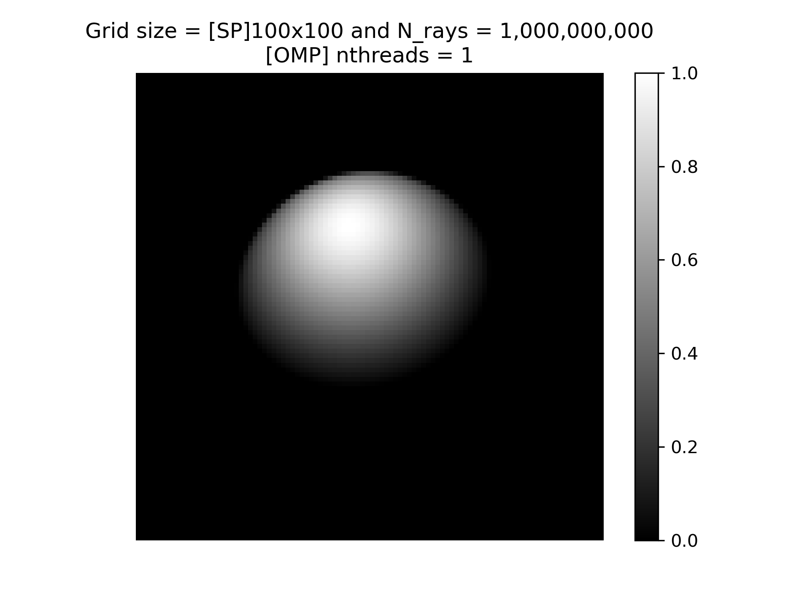
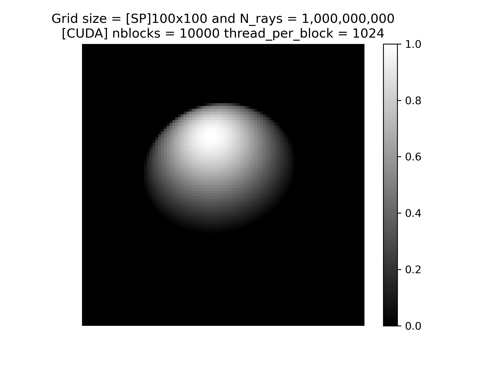

# Ray Tracing Performance Comparision with C, OpenMP, CUDA and MPI

## Code Structure and Implementation

The OpenMP + CUDA + MPI implementation is achieved through a single ray_tracing.cu file. The program takes the input of the various parameters from the CLI and then runs the algorithm as specified in the problem
statement. The flow of the program is as follows:
1. Take the input from the CLI and check if the number of arguments provided is correct. Start the gloabal timer for getting the total time.
2. Allocate the grid for outputting the image
3. Use the run_type variable `{1: omp only, 2: cuda only, 3: MPI}`, to determine what parts to run
4. Open the `omp-image.dat` file for writing the omp output and then run the algorithm on the specified number of threads using the correct pragma. I generate a different grid for each thread and then combine them back into one at the end. This is done to avoid the 1 billion atomic operations for grid update across each thread.
5. Open the `cuda-image.dat` file to write the cuda output. Copy the C and L vectors to constant device variables, malloc the device grid, and copy the grid from the host to the device. For cuda rand, I initialized a cuda rand state for each gpu thread and initialized each of them using a setup kernel function. Now run the main kernel with the calculated number of blocks and number of threads per block
6. For CUDA + MPI the output is written to the `cuda-image.dat`. The given number of rays is divided into two halves, with each GPU producing only half of the total number of specified rays. When each GPU is done, the loack grids are sent to rank 0 where it is combined and then put into the output file.

## Approach

* rand_r for omp and curand for cuda, are used as the xorwow PRG for generating the billion rays. 
* The L an C vectors are used as constants on the GPU
* Performance does not vary after increasing beyond 1000 blocks and hence all the tests are done with 10000 blocks and 1024 threads per block.
* The curandstate object is malloc’ed and initialized for each gpu thread (nblocks * num_threads_per_block).
* MPI implementation is very trivial. Each GPU produces half of total rays required.

**Note**: I convert the left hand coordinate system input to right hand system. The plots produced are as expected in the report

## Running the code

Load module `cuda` and `openmpi` then use the `make` commmand to compile the program.

```
module load cuda openmpi
make
```

The make file provides the following function, where each runs the program twice (once for 1000x1000 and then for 100x100) and plots the result:

1. `test_serial`: Runs the serial version of the program
2. `test_omp`: Runs the parallel version with the maximum number of threads available
3. `test_cuda`: Runs the CUDA version on the GPU
4. `test_mpi`: Runs the program on two GPUs using OpenMPI

To run manually do:

```
make
./ray_tracing <n_rays> <n_grid> <n_blocks> <ntpb> <run_type> <nthreads>
```
1. `n_rays`: Number of rays to plot (default 1e9)
2. `n_grid`: dimension of image/grid (default 1000)
3. `n_blocks`: number of blocks on one GPU
4. `ntpb`: number of GPU threads per block
5. `run_type`: Determine what to ru (default 2) `{1: omp only, 2: cuda only, 3: MPI}`
6. `nthreads`: Number of CPU threads to use (default max available)

## Example

```console
$ make && ./ray_tracing 1000000000 1000 10000 1024
nvcc ray_tracing.cu -use_fast_math -Xcompiler -fopenmp -O3 -o ray_tracing -lmpi -arch=sm_61

C = {0.00 12.00 0.00}
L = {4.00 4.00 -1.00}
Wy = 2.00 W_max = 2.00, R = 6.00, N_rays = 1.000000e+09, G_size = 1000

~~~~~~~~~~~~~~~~~~~~~~~~~~~~~~~GPU~~~~~~~~~~~~~~~~~~~~~~~~~~~~~~~

nblocks               : 10000
num_threads_per_block : 1024
Total GPU threads     : 1.024000e+07
Total GPU malloc size : 0.495520 GBs
Rays per thread       : 97.656250 rays

running CUDA version on GPU 0...

CUDA Time (GPU 0) = 0.152936 seconds     cnt = 0.000000e+00

Total Time = 0.477895 seconds

```
**NOTE**: `cnt` is number of sampled rays. Measuring `cnt` is very expensive and hence its statement is commented out in the source file. Because of this the value reads zero. To enable counting, uncomment the line in the code and compile and run again.

## Performance

| **Proc**       | **Grid** | **Time(SP)** | **K Time(SP)** | **Time(DP)** | **K Time(DP)** | **Blk/TPB** | **Cores**     | **Samples**  | **Optimizations** |
|----------------|----------|--------------|----------------|--------------|----------------|-------------|---------------|--------------|-------------------|
| A100           | 1000<sup>2</sup>    |      NA      |      NA        |      NA      |      NA        | 10000/1024  | 10.24 million | 7.46 billion |NA|
| A100           | 100<sup>2</sup>     |      NA      |      NA        |      NA      |      NA        | 10000/1024  | 10.24 million | 7.46 billion |NA|
| V100           | 1000<sup>2</sup>    | 0.482        | 0.150          | 0.679        | 0.351          | 10000/1024  | 10.24 million | 7.46 billion | Initialized curand seperately, used const GPU variable for L and C vectors, Grid striding nearly 100 rays per GPU thread, used `-use_fast_math` compiler flag|
| V100           | 100<sup>2</sup>     | 0.228        | 0.145          | 0.421        | 0.338          | 10000/1024  | 10.24 million | 7.46 billion | Same as above |
| RTX6000        | 1000<sup>2</sup>    | 0.953        | 0.582          | 6.124        | 5.755          | 10000/1024  | 10.24 million | 7.46 billion | Overall slower than v100 with the same optimization as v100 |
| RTX6000        | 100<sup>2</sup>     | 0.667        | 0.561          | 5.837        | 5.730          | 10000/1024  | 10.24 million | 7.46 billion | Same as above |
| CPU Serial     | 1000<sup>2</sup>    | 257.931      | 257.700        | 334.830      | 334.591        | -           | 1             | 7.46 billion | None |
| CPU Serial     | 100<sup>2</sup>     | 256.478      | 257.466        | 333.779      | 333.770        | -           | 1             | 7.46 billion | None |
| CPU OMP        | 1000<sup>2</sup>    | 5.861        | 5.446          | 7.542        | 7.074          | -           | 48            | 7.46 billion | Used seperate grid for each thread, no atomic operations, combined all grids back to one at the end |
| CPU OMP        | 100<sup>2</sup>     | 5.395        | 5.388          | 6.987        | 6.978          | -           | 48            | 7.46 billion | Same as above |
| >1GPU (2 V100) | 1000<sup>2</sup>    | 0.549        | 0.077          | 0.682        | 0.172          | 10000/1024  | 2 ranks       | 7.46 billion | GPU kernel call same as CUDA only version, used MPI_Recv and MPI_Send to get grid from GPU 1 to GPU 0 |
| >1GPU (2 V100) | 100<sup>2</sup>     | 0.333        | 0.073          | 0.422        | 0.169          | 10000/1024  | 2 ranks       | 7.46 billion | Same as above |


## Plots

<table>
<thead>
  <tr>
    <th>Proc</th>
    <th>Grid</th>
    <th>Single Precision</th>
    <th>Double Precision</th>
  </tr>
</thead>
<tbody>
  <tr>
    <td>A100</td>
    <td>1000<sup>2</sup></td>
    <td></td>
    <td></td>
  </tr>
  <tr>
    <td>A100</td>
    <td>100<sup>2</sup></td>
    <td></td>
    <td></td>
  </tr>
  <tr>
    <td>V100</td>
    <td>1000<sup>2</sup></td>
    <td></td>
    <td></td>
  </tr>
  <tr>
    <td>V100</td>
    <td>100<sup>2</sup></td>
    <td></td>
    <td></td>
  </tr>
  <tr>
    <td>RTX6000</td>
    <td>1000<sup>2</sup></td>
    <td></td>
    <td></td>
  </tr>
  <tr>
    <td>RTX6000</td>
    <td>100<sup>2</sup></td>
    <td></td>
    <td></td>
  </tr>
  <tr>
    <td>CPU Serial</td>
    <td>1000<sup>2</sup></td>
    <td></td>
    <td></td>
  </tr>
  <tr>
    <td>CPU Serial</td>
    <td>100<sup>2</sup></td>
    <td></td>
    <td></td>
  </tr>
  <tr>
    <td>CPU OMP</td>
    <td>1000<sup>2</sup></td>
    <td></td>
    <td></td>
  </tr>
  <tr>
    <td>CPU OMP</td>
    <td>100<sup>2</sup></td>
    <td></td>
    <td></td>
  </tr>
  <tr>
    <td>&gt;1GPU (2 V100)</td>
    <td>1000<sup>2</sup></td>
    <td></td>
    <td></td>
  </tr>
  <tr>
    <td>&gt;1GPU (2 V100)</td>
    <td></td>
    <td></td>
    <td></td>
  </tr>
</tbody>
</table>